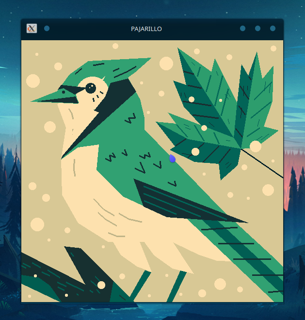

```bash
# El repositorio, junto a este archivo, es sólo muestra. 
# Todo el código y el repositorio original estan en privado.
```
# Pajarillo - Demo


# Pajarillo - Inicialización

**Clona y ejecuta el programa para ver a Pajarillo**

## Pasos

(Opción 1) Para clonar y ejecutar el proyecto necesitas instalar primero [Git](https://git-scm.com). Desde el terminal ingresa una por una las siguientes lineas:

```bash
# Clona este repositorio
git clone https://github.com/KeyCuevasMelgarejo/PAJARILLO
# Abrir y ejecutar el archivo main.cpp
```
(Opción 2) Simplemente descarga el archivo main.cpp
